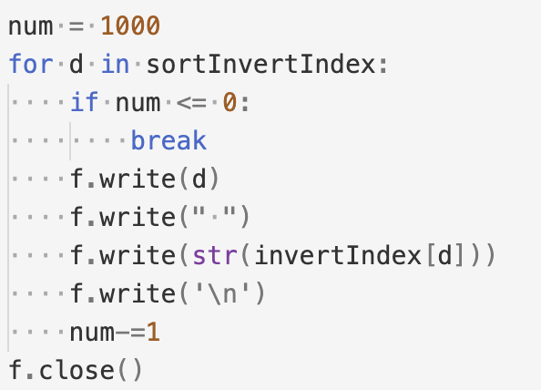
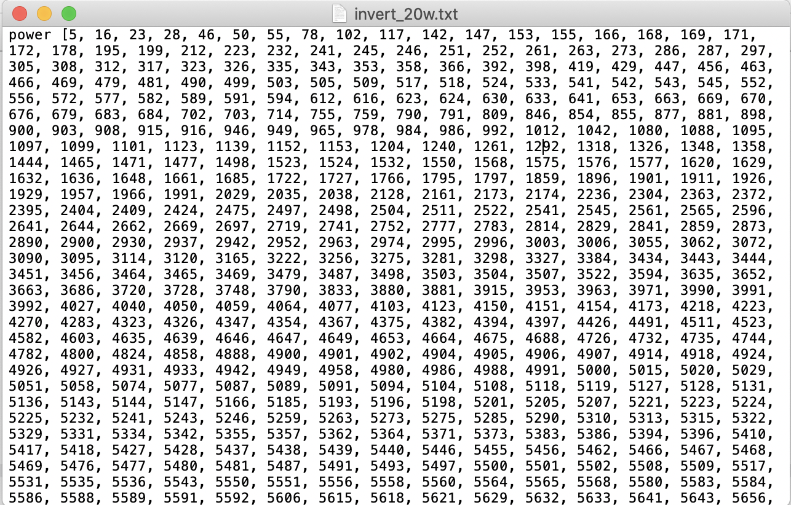

# lab1

### TODO list

- [x] 预处理-分词、词根化、去停用词处理
- [x] 建立倒排索引表，存储文件
- [ ] bool查询
- [ ] 计算bool查询的tdf-idf
- [ ] 计算语义查询的tf-idf

### 优化TODO

- [ ] 倒排索引过程优化
- [ ] 索引效果优化
- [ ] 其他语义表征查询和文档

### README，及实验报告部分，做了啥就写一点，最后再来整理

- 一开始的方法：循环每一篇文档，使用正则化方法处理一些非文本等无关内容，如邮件头部，HTML标签等等，然后进行分词，去停用词，词根化。输出，即保存倒排表用了很蠢的方法。
  - 
  - 
  - 
- 