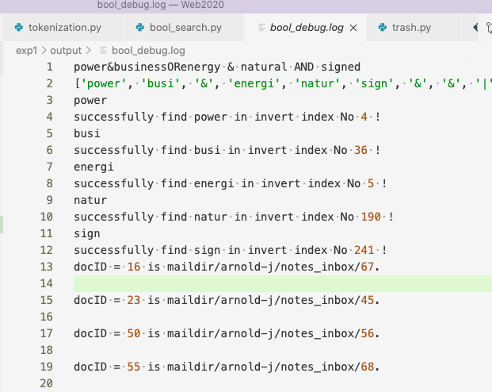

# lab1

### TODO list

- [x] 预处理-分词、词根化、去停用词处理
- [x] 建立倒排索引表，存储文件
- [x] bool查询
- [ ] 计算bool查询的tdf-idf
- [ ] 计算语义查询的tf-idf

### 优化TODO

- [ ] 倒排索引过程优化
- [ ] 索引效果优化
- [ ] 其他语义表征查询和文档

### README，及实验报告部分，做了啥就写一点，最后再来整理

- 一开始的方法：循环每一篇文档，使用正则化方法处理一些非文本等无关内容，如邮件头部，HTML标签等等，然后进行分词，去停用词，词根化。输出，即保存倒排表用了很蠢的方法。
  - 
  - 
  - 

#### 布尔检索部分：

考虑到群里的要求，需要做一个语义分析。

~~根据，OR，AND，NOT由低到高的优先级，一个bool检索可写成如下文法。~~

$E\to E\  \mathbf{OR}\  T\  |\  T$； $T\to T\mathbf{AND}F\ |\ F$； $F\to \mathbf{NOT}\ F\ |\ (E)\ |\ \mathbf{token}$

将布尔表达式的中缀式换成后缀式即可，实现在`bool_search.py`文件中

其中，函数意义分别如下：

- `parse_query()`用来将表达式正则化，并转化为后缀式，以列表的形式存储。
- `load_index()`从倒排文件中，找到相对应的词项及其文档表，以列表的形式返回
- `bool_AND(),bool_OR(),bool_NOT()`分别是三个不同操作符的实现
- `search()`是对`parse_query()`得到的操作符和词项的栈进行操作，并返回bool查询的最终结果

输入：

- 为书上的布尔查询的式子，操作符按优先级依次为NOT，AND，OR，或者！，&，｜，可以加入括号。
- 可以使用`--file FILEPATH`参数指定读取指定位置的文件
- 可以使用`--scan`从键盘键入

输出：

- 第一行是原表达式的输出
- 第二行是表达式在栈中的后缀表达式形式
- 第三行往后是提示在第几个倒排项找到了某个词
- 以及布尔查询结果的输出，如图（在截图之后优化了索引，导致结果可能不完全一样）

