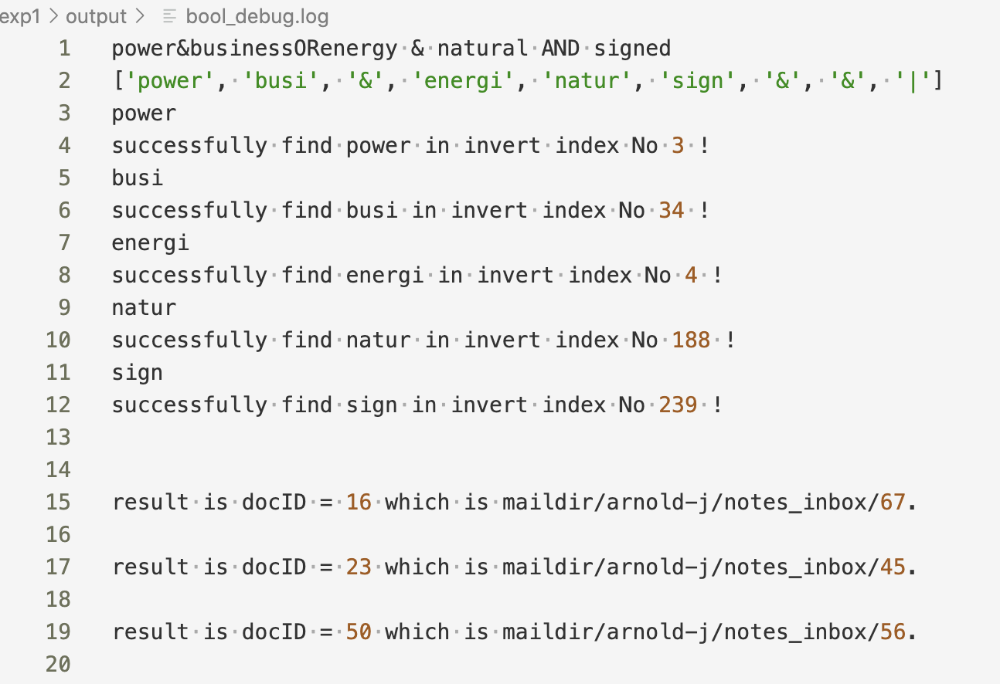
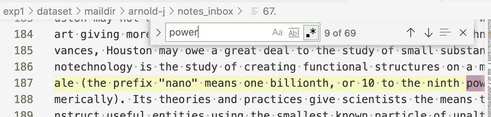

## Lab1-实验报告

### 代码描述

#### `tokenization_opt.py`

这个代码在utils文件夹里，读取path文件，用来生成倒排表（前一千）

1. 首先利用正则化过滤文件（邮件头部，邮箱地址，URL，HTML标签），减小分词工作量以及优化索引效果
2. 接着迭代读取每个文档，进行如下操作：
3. 使用nltk包进行分词，去停用词，使用SnowballStemmer进行词根化，存到同名文件中
   - 在一开始并没有选择将其存储，但考虑到建立矩阵时还需要用到，为了保证一致性便选择存储。
4. 直接进行倒排索引的构建，把索引看成是一个字典\<token, [docID, docID2, ...]\>，对每个词进行遍历：
   - 若某词项有对应key，则看对应列表的最后一个有无该词^优化^，没有则append进去
   - 若某词项没有，则给该词项建立初始为此时的docID的列表项
5. 输出倒排表为index.txt，在迭代时，将其输出为间距格式^优化^，同时还输出df.txt即词项的df值。

#### `bool_search.py`

这个代码在src文件夹中，获取Bool查询的输入，用来输出符合规则的相应文档：

1. 首先是获取输入，以下是一开始的蠢想法：

     > 考虑到群里的要求，需要做一个语义分析。
     > ~~根据，OR，AND，NOT由低到高的优先级，一个bool检索可写成如下文法。~~
     > $E\to E\  \mathbf{OR}\  T\  |\  T$； $T\to T\mathbf{AND}F\ |\ F$； $F\to \mathbf{NOT}\ F\   
     > |\ (E)\ |\ \mathbf{token}$ 
     > 最后发现，将布尔表达式的中缀式换成后缀式即可
     
     以上的实现写在`parse_query()`中
     
2. 其中，函数意义分别如下：

     - `parse_query()`用来将表达式正则化，词根化，并转化为后缀式，以列表的形式存储。
     - `load_index()`从倒排文件中，找到相对应的词项及其文档表，以列表的形式返回
       - 直接遍历获取，没什么说的
       - 把间距变回正常序号
     - `bool_AND(),bool_OR(),bool_NOT()`分别是三个不同操作符的实现
       - AND是一个个比对，保留相同的。使用书上的合并算法（没有跳表指针，因为没要求（（（
       - OR是一个个比对，有就留下来，注意一个表遍历完了还要继续遍历没完的。
       - NOT是直接对这个表求反，即返回所有DOC集合没有这个文档的
     - `search()`是对`parse_query()`得到的操作符和词项，存入栈中，进行操作，并返回bool查询的最终结果
       - 即是后缀表达式的计算规则
       - 迭代输入，如果是词项，放进栈中；如果是AND或OR，则对栈头两个元素操作，结果放回栈里；如果是NOT，则只对一个元素进行操作。知道遍历完输入，吐出栈底元素。

3. 通过`search()`获得的即为文档列表，并对其包装，输出

     - 第一行是原表达式的输出
     - 第二行是表达式在栈中的后缀表达式形式
     - 第三行往后是提示在第几个倒排项找到了某个词
     - 以及布尔查询结果的输出(通常很长)，如图及索引结果验证
     - 
     - 

#### `tf_matrix.py`

代码在utils文件夹里，用来生成tf-idf矩阵

