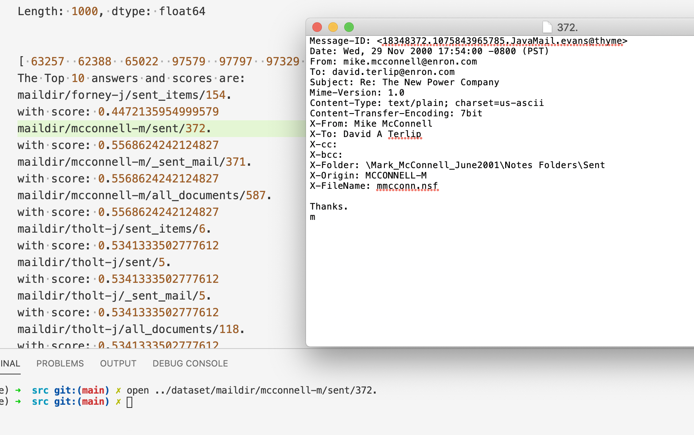
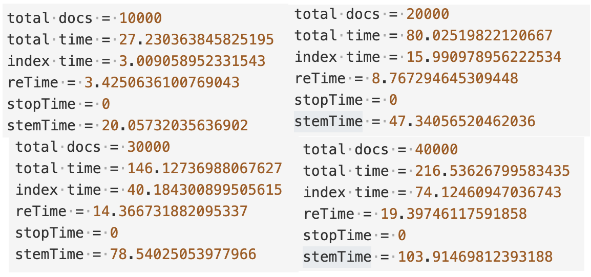
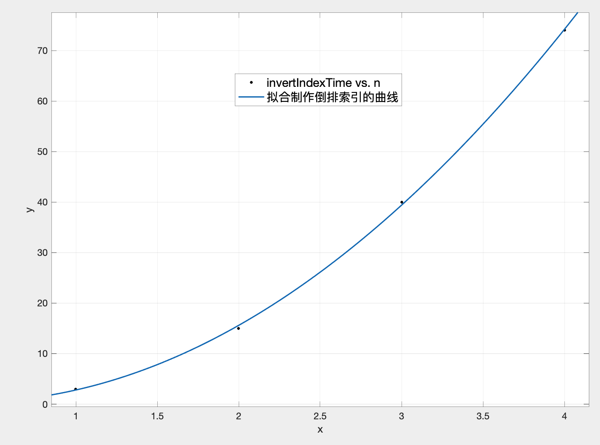
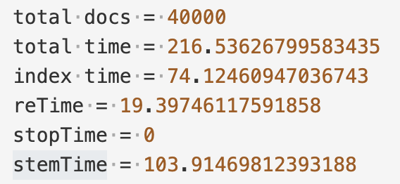
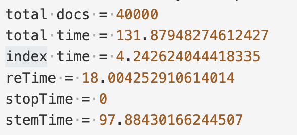
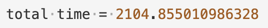

## Lab1-实验报告

钟溯飏 PB18111764

单航 

### 代码描述

#### `tokenization_opt.py`

这个代码在utils文件夹里，读取path文件，用来生成倒排表（前一千）

1. 首先利用正则化过滤文件（邮件头部，邮箱地址，URL，HTML标签），减小分词工作量以及优化索引效果
2. 接着迭代读取每个文档，进行如下操作：
3. 使用nltk包进行分词，去停用词，使用SnowballStemmer进行词根化，存到同名文件中
   - 在一开始并没有选择将其存储，但考虑到建立矩阵时还需要用到，为了保证一致性便选择存储。
4. 直接进行倒排索引的构建，把索引看成是一个字典\<token, [docID, docID2, ...]\>，对每个词进行遍历：
   - 若某词项有对应key，则看对应列表的最后一个有无该词[^优化^](#结果优化)，没有则append进去
   - 若某词项没有，则给该词项建立初始为此时的docID的列表项
5. 输出倒排表为index.txt，在迭代时，将其输出为间距格式[^优化^](结果优化)，同时还输出df.txt即词项的df值。

#### `bool_search.py`

这个代码在src文件夹中，获取Bool查询的输入，用来输出符合规则的相应文档：

1. 首先是arg_parse获取输入，以下是一开始的蠢想法：

     > 考虑到群里的要求，需要做一个语义分析。
     > ~~根据，OR，AND，NOT由低到高的优先级，一个bool检索可写成如下文法。~~
     > $E\to E\  \mathbf{OR}\  T\  |\  T$； $T\to T\mathbf{AND}F\ |\ F$； $F\to \mathbf{NOT}\ F\   
     > |\ (E)\ |\ \mathbf{token}$ 
     > 最后发现，将布尔表达式的中缀式换成后缀式即可
     
     以上的实现写在`parse_query()`中
     
2. 其中，函数意义分别如下：

     - `parse_query()`用来将表达式正则化，词根化，并转化为后缀式，以列表的形式存储。
     - `load_index()`从倒排文件中，找到相对应的词项及其文档表，以列表的形式返回
       - 直接遍历获取，没什么说的
       - 把间距变回正常序号
     - `bool_AND(),bool_OR(),bool_NOT()`分别是三个不同操作符的实现
       - AND是一个个比对，保留相同的。使用书上的合并算法（没有跳表指针，因为没要求（（（
       - OR是一个个比对，有就留下来，注意一个表遍历完了还要继续遍历没完的。
       - NOT是直接对这个表求反，即返回所有DOC集合没有这个文档的
     - `search()`是对`parse_query()`得到的操作符和词项，存入栈中，进行操作，并返回bool查询的最终结果
       - 即是后缀表达式的计算规则
       - 迭代输入，如果是词项，放进栈中；如果是AND或OR，则对栈头两个元素操作，结果放回栈里；如果是NOT，则只对一个元素进行操作。知道遍历完输入，吐出栈底元素。

3. 通过`search()`获得的即为文档列表，并对其包装，输出

     - 第一行是原表达式的输出
     - 第二行是表达式在栈中的后缀表达式形式
     - 第三行往后是提示在第几个倒排项找到了某个词
     - 以及布尔查询结果的输出(通常很长)，如图及索引结果验证
     - 
     - 

#### `matrix.py`

代码在utils文件夹里，用来生成tf-idf矩阵

1. 首先获取文档数目，然后打开df.txt读取词项-DF对，并计算idf
2. 遍历之前存储的分词后的文档，存储tf值。
3. 根据tf-idf公式$W_{t,d}=(1+\log tf_{t,d})\cdot \log N/df_t$，循环填入矩阵
4. 使用`scipy.sparse.csr_matrix`按行压缩并使用save_npz存储

#### `semantic_search.py`

代码在src文件夹里，用来计算相似度并排序

1. 老样子使用argparse来获取参数输入，并用`sparse.load_npz`读取压缩文件（很耗时）
   - 打印了`head()`，可以看到tf-idf的大概样子
2. 使用`split()`和词根化获取输入，并根据token位置存成向量的形式
3. 使用余弦相似度对查询向量与tf-idf向量迭代进行运算，并将结果存放在`result`里面
4. 使用pandas进行排序，并包装结果进行输出：

使用查询“The president plans to be a power and energy company” 结果如图：



### 结果优化

#### 1.索引的时空复杂度的优化

**时间优化：** 之前用以下python式语句判断是否添加倒排表词项：

```python
if docID not in invertIndex[token]:
```

这导致时间复杂度与文档数量不成线性关系，是$O(n^2)$的，输出小规模的耗时如图及拟合图：





这导致若是大规模进行生成，需要数小时，很不现实。于是做了一个修改：

```python
if invertIndex[token][-1] != docID :
```

这就使得时间大幅降低：

原：改进：

最终耗时为，可以接受

**空间优化：**

与讲义不同，并不是读取所有文档后再进行建立索引，那样至少会占用所有文档大小的内存。本实验采用迭代文档分别进行分词，词根化，添加进倒排表的操作。并对其进行了如上的时间优化。

存储也做了优化：在一开始，输出，即保存倒排表，这里用了很蠢的方法，即直接保留ID：

 

可以看到才20w就已经74MB了，所以才用了存储间距的方法：最后50w文档生成的大小为：


以上。