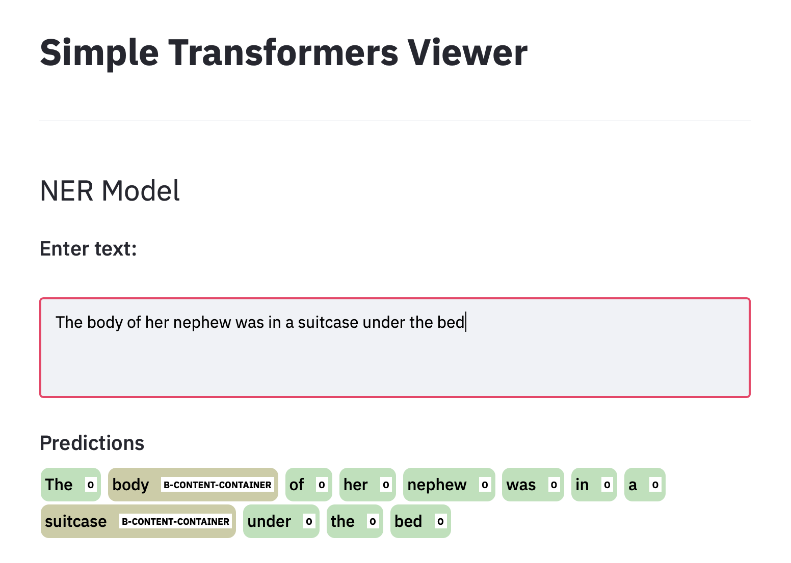
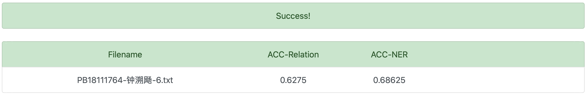

## Lab2-实验报告

钟溯飏 PB18111764

单航 PB18111747

### 大体概要

1. 使用Apple的开发者文档，Swift语言，简单的调用API完成分类任务
   - ACC-relation=0.48
2. 使用Python中sklearn的各种分类器（Naive-Bayes，SGD）以及特征提取工具（TF-iDF），自己尝试的特征提取工具（Onehot，Doc2Vec）进行分类任务尝试（自己动手）
   - TF-iDF+NB的ACC-relation=0.41
   - TF-iDF+SGD的ACC-relation=0.47
3. 处理数据，丢到百度的免费[EasyDL平台](https://ai.baidu.com/easydl/)（不是打广告，用了发现没啥用）
   - 并不能把模型给我，自己的验证精度是[60%](./figs/baidu.png)
   - 想试实体关系联合抽取，反正免费的资源跑不通
4. 使用simpletransformer进行关系抽取，并用这个微调过的模型继续进行实体识别的训练。
   - 调用RoBERTA预训练模型，ACC-relation=0.66875
   - NER模型，采用上述微调后的模型，ACC-relation=0.6275，ACC-NER=0.68625

### 代码及实验过程描述

讲述`exp2/src/`以下的代码

主要讲述了我是怎么一步步有进展的，觉得啰嗦可以直接看[最后的模型](#Simpletransformer)

#### relation_classifier.playground (swift)

##### 代码解释

使用macOS下的swift中的[NLModel](https://developer.apple.com/documentation/naturallanguage)（处理自然语言），以及[CoreML](https://developer.apple.com/documentation/coreml)支持，简单的完成了任务，即调用swift官方提供的方法，把此次任务视作分类问题，进行尝试。

1. 将数据集`train.txt`转换为**CreateML**包所需要的json文件，并实现在`src/txt2json_train.py`以及`src/txt2json_test.py`中。
   - 这里简单的正则去除了标点（不过后来发现貌似`MLTextClassifier`会自己分词去标点）
2. 使用`playground/dev_classifier`去进行试验的测试。首先使用`randomSplit`进行训练集与验证集的划分，以便查看实验效果。
3. 然后调用`MLTextClassifier`进行训练，使用`evaluation`方法进行评估。
   - 使用的是MaxEnt的分类方法
   - 精度为(1-误差率)*100
4. 在最终模型`playground/classifier`里，循环迭代1600次`relationClassifier.prediction`，输出结果，并提交到平台。

##### 实验过程与结果

简单的调包后发现精度有0.6，于是欢欢喜喜的直接训练。交完以后orz了

看来还得往下做。


#### classifier.py(python)

##### 代码解释

提取特征向量然后使用NB或者SGD进行分类。并使用脚本调参。

1. 代码实现在`classifier.py`文件中，使用sklearn的naive_bayes及SGD和feature_extraction中的TfidfVectorizer提取特征进行实现。
   - 尝试过使用所有实体作为标签使用OneHot编码，效果不好。
   - 尝试过使用Doc2Vec进行特征化并SGD分类，效果也不好
2. 对数据的预处理和之前一样
   - 值得一提的是，使用停用词，反而在自己划分的数据集下有精度下降，就没有尝试了。
3. 将`train.txt`前1/3划分为验证集，后2/3为训练集（自己不会K-Fold）；使用`train.sh`或者`--mode dev`进行调参，以0.009为step循环一百次，`calc_diff.py`计算，并寻找较高的精确值。然后再用0.0009为step循环100次。最后选取最优值的alpha带入总的数据集进行训练
   - 这些日志记录在`src/*.log`中，其中NB最好的一次ACC为0.518
   - SGD最好的结果为0.6+
4. 得出结果提交平台

##### 实验过程与结果

NB这效果还更差了，只有[0.409](figs/nb_fig2.png)。（和swift版本差不多，都比本地精度小个0.1左右）

使用SGD进行分类，效果也不大好，只有[0.47](figs/SGD_fig1.pn)，甚至都没有swift高

看来不能只用传统分类器了。（传统分类器的能力是有极限哒！）


#### Simpletransformer_RoBERTa

然后就使用了simpletransformer，使用了RoBERTa预训练模型进行训练，位于`transformer_roberta.py`中，并加载训练模型进行测试位于`classifier.py`中，结果很好：

hyperparameter为默认，device=cpu（因为是mac）epoch=1


神经网络yyds！

分类任务精度应该这么多足够了。下面开始NER任务。


#### NER_RoBERTa_model

此任务拿之前在训练集上微调过的模型继续进行(epoch=1，device=cpu)的训练

- 使用B-I-O序列标注。并没有手动标注，而是简单的将关系和实体做映射，总共21种labels

  - 对`train.txt`先进行分词，然后对偶数行（即关系实体对）根据[官方文档](https://simpletransformers.ai/docs/ner-data-formats/)进行处理。
  - B代表词的开头或者单独的词，I代表实体的除开头的词，O代表非实体。
  - 简单将关系和实体做映射，并考虑序列位置，即
    - 形如`Component-Whole(elements,configuration)`
    - 被标注为 `elements: B-COMPONENT-WHOLE`；`configuration: B-COMPONENT-WHOLE`
  - 将数据整理成Dataframe格式并存起来（先append成list再转化比直接插入df不知道快到哪里去）
  - 考虑到这样处理，那么抽取实体和关系判别就是一起的了。

- 创建模型

  - ```python
    model = NERModel("roberta", "./outputs/", labels=relationLabels,use_cuda=False, args=modelArg)
    ```
  
- 训练模型，并用模型预测(`NER.py`)

- 使用streamlit观看结果

### 尝试优化

- 传统分类器部分尝试过使用Doc2Vec进行特征提取，或者Boost分类之类，效果不佳。

### 实验总结

- 使用传统分类器实现分类任务
- 使用神经网络分类器实现分类任务
- 实现实体识别任务

  - 采用streamlit包，产生了如下界面，可见第一个测试用例结果与样例是一样的
  - 
- 实现同时实体识别以及关系分类的任务
- 最终两个最高得分如下：

关系抽取：


同时完成：



### 实验心得

- 处理数据几乎花了一半的时间，包括但不仅限于：
  - 将数据转化为swift的格式并处理Xcode的IO
  - 将数据进行清理方便sklearn读入
  - 将数据转化为baidu的格式（早知道不弄这个了），doc2vec格式，CoNLL等。
- 自己累死累活找传统方法，不如直接找现有模型
  - （主要是mac没有CUDA很难跑神经网络，一开始没往这里想）