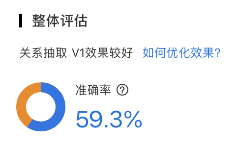
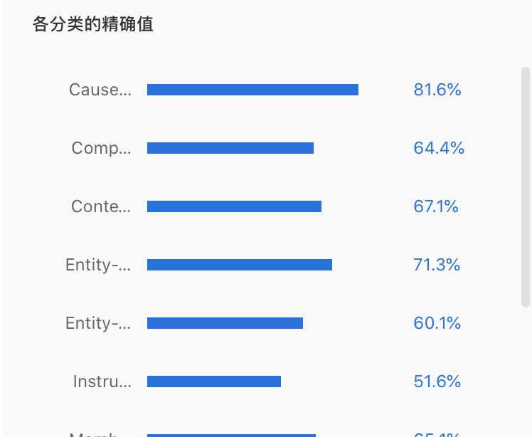

## Lab2-实验报告

钟溯飏 PB18111764

单航 PB18111747

### 代码及实验过程描述

讲述`exp2/src/`以下的代码

#### relation_classifier.playground (swift)

##### 代码解释

使用macOS下的swift中的[NLModel](https://developer.apple.com/documentation/naturallanguage)（处理自然语言），以及[CoreML](https://developer.apple.com/documentation/coreml)支持，简单的完成了任务，即调用swift官方提供的方法，把此次任务视作分类问题，进行尝试。

1. 将数据集`train.txt`转换为**CreateML**包所需要的json文件，实现在`src/txt2json_train.py`以及`src/txt2json_test.py`中。
   - 这里简单的正则去除了标点（不过后来发现貌似`MLTextClassifier`会自己分词去标点）
2. 使用`playground/dev_classifier`去进行试验的测试。首先使用`randomSplit`进行训练集与验证集的划分，以便查看实验效果。
3. 然后调用`MLTextClassifier`进行训练，使用`evaluation`方法进行评估。
   - 使用的是最大熵的分类方法
   - 精度为(1-误差率)*100
4. 在最终模型`playground/classifier`里，循环迭代1600次`relationClassifier.prediction`，输出结果，并提交到平台。

##### 实验过程与结果

简单的调包后发现精度有0.6，于是欢欢喜喜的直接训练

交完以后orz了

看来还得往下做。

#### classifier.py(python)

##### 代码解释

提取特征向量然后使用NB或者SGD进行分类。并使用脚本调参。

1. 代码实现在`NB_classifier.py`文件中，使用sklearn的naive_bayes及SGD和feature_extraction中的TfidfVectorizer提取特征进行实现。
   - 尝试过使用所有实体作为特征词使用OneHot编码，效果不好。
   - 尝试过使用Doc2Vec进行特征化并SGD分类，效果也不好
2. 对数据的预处理和之前一样
   - 值得一提的是，使用内置的停用词，反而在自己划分的数据集下导致精度下降。
3. 将`train.txt`前1/3划分为验证集，后2/3为训练集（自己不会K-Fold）；使用`train.sh`进行调参，以0.009为step循环一百次，`calc_diff.py`计算，并寻找较高的精确值。然后再用0.0009为step循环100次。最后选取最优值的alpha带入总的数据集进行训练
   - 这些日志记录在`src/*.log`中，其中最好的一次ACC为0.518
4. 得出结果提交平台

##### 实验过程与结果

这效果还更差了。（和swift版本差不多，都比本地精度小个0.1左右）

使用SGD进行分类，效果也不大好，看来不能只用传统分类器了。

搜了搜百度，发现有一个EasyDL平台，于是仿照要求处理数据并提交

考虑到先前两个在正式测试集上精度都会下降，看起来也就这么多了（分类的力量是有极限的！）

