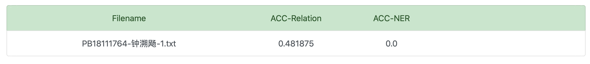

## Lab2-实验报告

钟溯飏 PB18111764

单航 PB18111747

### 代码及实验过程描述

讲述`exp2/src/`以下的代码

#### relation_classifier.playground (swift)

##### 代码解释

使用macOS下的swift中的[NLModel](https://developer.apple.com/documentation/naturallanguage)（处理自然语言），以及[CoreML](https://developer.apple.com/documentation/coreml)支持，简单的完成了任务，即调用swift官方提供的方法，把此次任务视作分类问题，进行尝试。

1. 将数据集`train.txt`转换为**CreateML**包所需要的json文件，实现在`src/txt2json_train.py`以及`src/txt2json_test.py`中。
   - 这里简单的正则去除了标点（不过后来发现貌似`MLTextClassifier`会自己分词去标点）
2. 使用`playground/dev_classifier`去进行试验的测试。首先使用`randomSplit`进行训练集与验证集的划分，以便查看实验效果。
3. 然后调用`MLTextClassifier`进行训练，使用`evaluation`方法进行评估。
   - 使用的是最大熵的分类方法（没研究清楚怎么修改超参，应该不行，所以待会自己手搓一个）
   - 精度为(1-误差率)*100
4. 在最终模型`playground/classifier`里，循环迭代1600次`relationClassifier.prediction`，输出结果，并提交到平台。

##### 实验过程与结果

简单的调包后发现精度有0.6，于是欢欢喜喜的直接训练

交完以后orz了

看来还得往下做。

#### Naive_Bayes(python)

