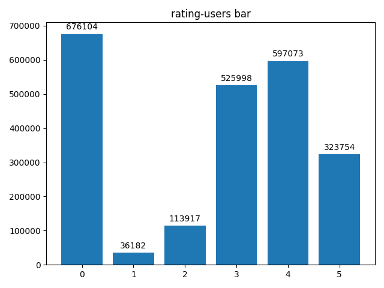

## WebInfo-Lab3-实验报告

钟溯飏 PB18111764

单航 PB18111747

### 数据预处理

考虑到本次实验提供的数据集十分规整，可直接使用`pandas`读取，并没有做细致的数据预处理工作，直接读取训练集中的[user, item timestamp, tag1]，并忽略后续所有tag。对训练集进行了一系列的分析：

###### 评分及人数的分布图

```python
rects = plt.bar(rating, height=rateCnt, label=label)
autolabel(rects)
plt.show()
```

<center></center>

###### 用户评分矩阵（见上）[已放大局部]

```python
plt.scatter(trainData['user_id'], trainData['mov_id'], s = 0.5,label = 'trainData')
plt.scatter(testData['user_id'], testData['mov_id'], c='red', s=0.5, label = 'testData')
plt.show()
```

由左图可以看出0分项比较多（正常现象），以及这个训练集的一个大致分布情况。

对于右图，可以清晰的看见有几条密集的横点列。此数据集movie会出现**长尾**现象。并且分析整张右图则发现，movie数目非常多，而对于user来说则比较随机，经此分析应当使用基于用户的协同过滤，并且不可以使用SlopeOne算法。

<div STYLE="page-break-after: always;"></div> 

在进行简单的[user item rating]训练后，进行了额外的分析，此时考虑到了**标签**：

###### 考虑到标签的分布图

```python
tagRating['tag'] = pd.isna(trainData['tag'])
tagRating.groupby('tag')['rating'].value_counts().plot.bar()
```


<center>True 代表无标签， False代表至少有一个标签</center>

可见无标签的分布与有标签分布基本完全一样，但发现，有且仅有无标签的0分比有标签多约200000条。可以分析出，这些零分是一些水军或者闲着没事的恶意行为，是具有完全的随机性的。于是进一步分析，通过观察数据集可以发现，这些零分大量存在于某些用户于**某些时段**进行的大量刷零操作。将user_id和timestamp进行groupby操作，产生一个multiindex的DataFrame：

```python
userTimeRating = trainData.groupby(['user_id', 'timestamp'])
userTimeRatingMean = userTimeRating['rating'].agg('mean')
userTimeRatingMean.to_csv("../output/userTimeRatingMean.csv")
print(userTimeRatingMean)
```

<center></center>

<center>左图为(user_id timestamp)对应的均分， 右图为截取其中大量出现0分的条目</center>

而简单的使用[user item rating]的模型所预测出的结果，很可能因为item均分的干扰，并没有考虑到这些随机但是跟时间段相关的刷零操作，导致结果不好。推测是出现于用户随机的个人行为，可能与当时评分的心情和时间等因素有关。

所以需要额外判断这个用户的这一时段操作是否属于**零分时段**，这样能有助于提升效果

<div STYLE="page-break-after: always;"></div> 

### 构建模型

本实验基于python的[surprise库](https://surprise.readthedocs.io/en/stable/getting_started.html)提供的一些预测模型。

#### 大体概览

- 使用SVD，KNN，Baseline，以及CoClustering模型，并使用bagging的方法将其集成，将预测结果四舍五入后，以2:1:1:1的比例进行投票，作为基础模型。
- 使用GridSearchCV，根据RMSE标准进行网格搜索调参，优化SVD的预测效果。
- 根据之前预处理的结果，将推测有恶意刷分的评分归零，以提升精度。

#### SVD-奇异值分解

此为基于模型的推荐，即使用矩阵分解的方法，将评分矩阵分解成User矩阵和Item矩阵，而优化目标就是使得User*Item与已知评分矩阵的差异最小，是一类目标函数最优化问题。经过尝试，本次实验使用的是BiasSVD，即对于评分加上了个人喜好作为偏置：
$$
\hat r_{ui}=\mu + b_u+b_i+q_i^Tp_u
$$
此式中，如果user信息未知，则$b_u=p_u=0$，item一样。

采用SGD去优化目标函数：
$$
\sum_{r_{ui} \in R_{train}}(r_{ui}-\hat r_{ui})^2+\lambda(b_i^2+b_u^2+||q_i||^2+||p_i||^2)
$$
经过训练，得到对应的Item和User矩阵，即可进行预测。在训练时，使用K-Folds将数据集与训练集进行划分，并进行迭代训练和验证，最终获得结果。(1.49)

##### SVD优化

考虑到这是一个模型训练，显然需要进行略微的调参。使用最基础的**网格搜索**调参，对`lr_all, reg_all, epochs`进行调试:

```python
gs = GridSearchCV(SVD, param_grid, measures=['rmse'], cv=3, joblib_verbose=2, n_jobs=2)
```

最终得到一组较优的参数组`{'n_epochs': 20, 'reg_all': 0.08, 'lr_all': 0.005,}`

#### KNN-基于用户的协同过滤

为了尝试更多的效果，还尝试了了KNN算法，而本次实验抹去个人兴趣的方法并不是减去平均值，而是减去$b_{vi}$，即减去baseline评分：
$$
\hat r_{ui}=b_{ui}+\dfrac{\sum_{v\in N_k^i(u)}sim(u,v)\cdot (r_{vi}-b_{vi})}{\sum_{v\in N_k^i(u)}sim(u,v)}
$$
考虑到item有70000种，那么计算sim计算量会很大，因此选择了默认的user-based协同过滤，同时，经过K-Folds数次调试，根据RMSE值选择K=10，即近邻数为10。同时相似度衡量选择pearson_baseline.

```python
sim_options = {'name': 'pearson_baseline',
               'shrinkage': 0
               }
algo = KNNBaseline(k=10, sim_options=sim_options)
```

经过在线提交发现，KNN的效果其实没有SVD好。

#### Bagging

##### 逐个训练模型

将之前的SVD及KNN模型dump出来：

```python
dump.dump("../output/SVDbias.model",algo=algo)
```

同时训练另外两个模型：

- BaselineOnly：遵从奥卡姆剃刀原则，仅仅考虑均值，User和Item的bias。简单快速
- CoClustering：将User和Item同时聚类

##### 预测

迭代testData,用各种模型对每个条目进行预测，存入numpy数组中，以便使用

```python
voteArray = np.zeros(5)
voteArray[0] = algoSVDBias.predict(userid, itemid)[3]
```

最后统计各个模型预测结果，并进行投票，存入列表`results`中：

```python
roundArray = np.round(voteArray).astype(int)
counts = np.bincount(roundArray)
results.append(np.argmax(counts))
```

##### 考虑刷零

读取trainData，将user在每个timestamp下的均分计算并存储：

```python
userTimeRating = trainData.groupby(['user_id', 'timestamp'])
userTimeRatingMean = userTimeRating['rating'].agg('mean')
```

使用`iterrows()`迭代testData的每一列，读取对应时间下对应user的均分`avgRating`，若traindata中无相对应时间，则为默认`trainRatingMean`。当`avgRating<=1`，并且bagging的各个模型预测Rating的均值都不高，可以认为这个时段的这个user是在刷零，那么就直接将其置为0:

```python
if avgRating <= 1.0 and ans <=3:
    results.append(0)
```

以上，就是最终模型的全部内容。

### 测试集结果


### 模型分析

本模型大致提升过程是：

单纯SVD(1.4523) => 多模型bagging(1.4508) => 考虑时间(1.4461)

- 多模型bagging之所以好一些，是因为使用模型平均，这样就可以减少泛化误差。

- 在加入额外的考虑用户在不同时间的均分后，使得预测效果对于评分较低的条目更加精确：

  